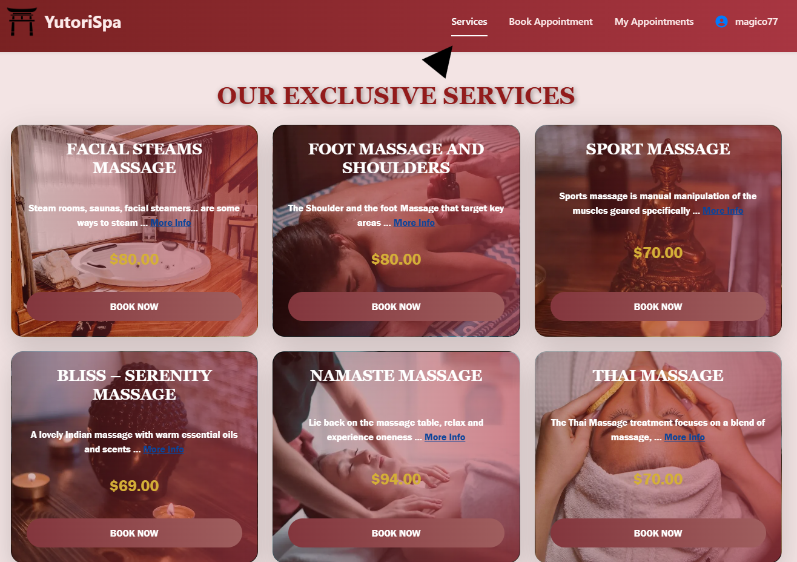
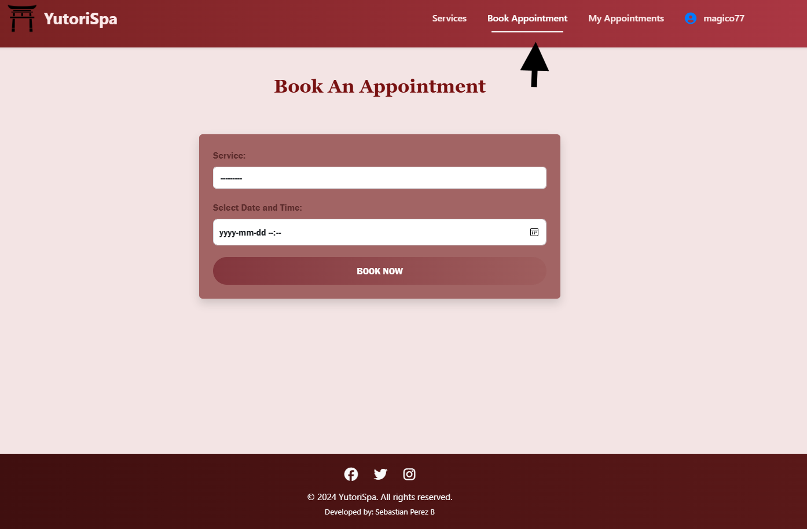
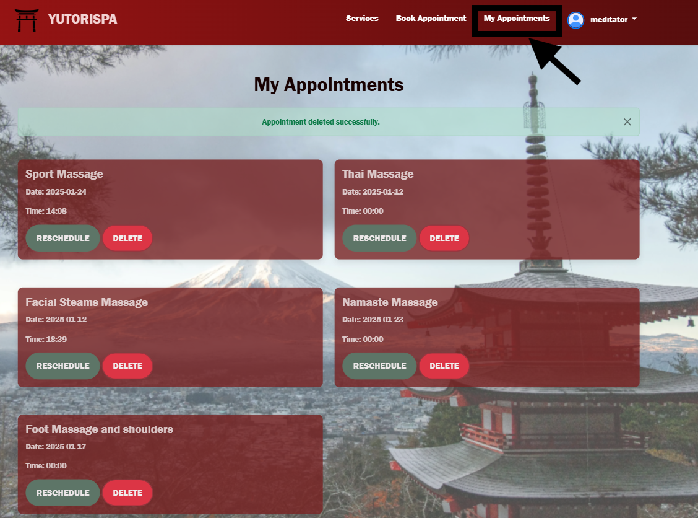
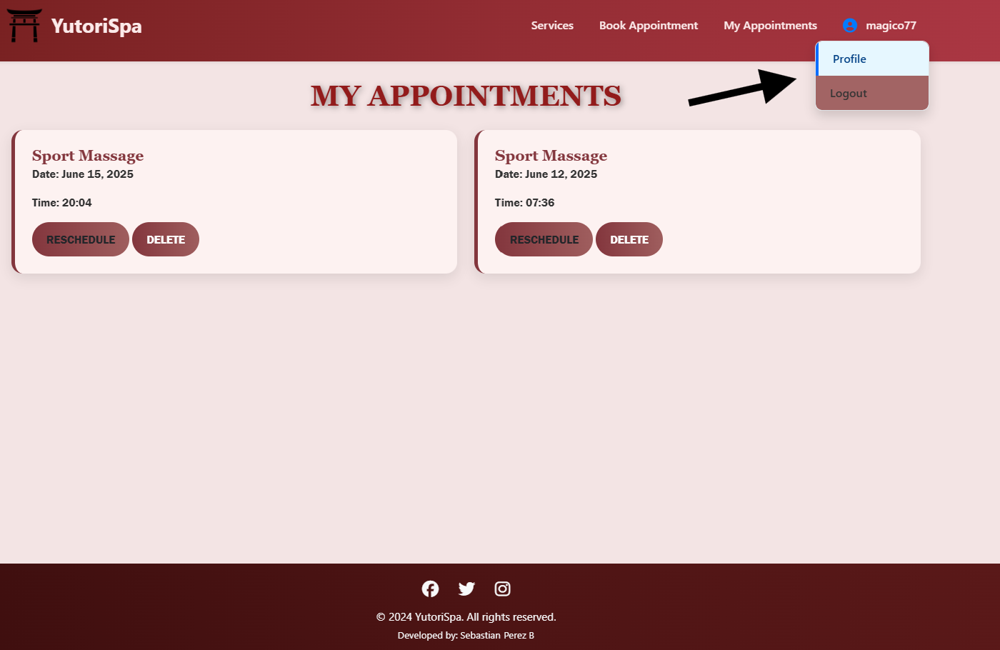
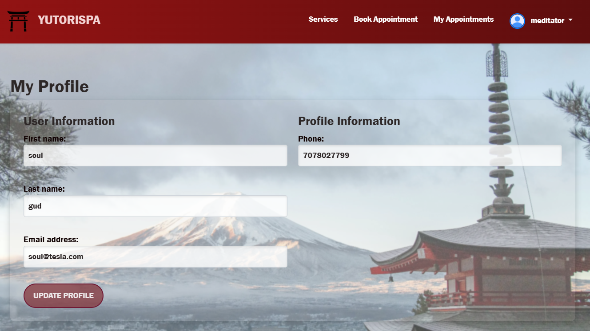

# YutoriSpa

🚀 [Live Site on Heroku](https://yutorispa-4e43a431e62f.herokuapp.com/)

Welcome to **YutoriSpa**, a web application that offers a variety of massage services to customers. Users can create accounts, book appointments, reschedule, and manage their bookings—all in one convenient place. Our goal is to help you relax and rejuvenate by embracing the Japanese philosophy of **Yutori**, which emphasizes creating **a space for peace of mind**.

---

## Table of Contents

1. [Features](#features)
2. [Design Process](#design-process)
   - [Wireframes](#wireframes)
   - [Mockups](#mockups)
3. [Key Sections](#key-sections)
   - [Header](#header)
   - [Service List](#service-list)
   - [Booking System](#booking-system)
   - [Manage Your Booking](#manage-your-booking)
   - [User Profile](#user-profile)
   - [Footer](#footer)
4. [Technologies](#UsedTech)
5. [Testing](#testing)
   - [Manual Testing](#manual-testing)
   - [Validation Tools](#validation-tools)
6. [Deployment](#deployment)
7. [Security](#security)
8. [Agile Development](#agile-development)
9. [Credits and Acknowledgments](#credits-and-acknowledgments)

---

## Features

- **Navigation Bar**: Clean layout with links to services, appointment booking, user profiles, login, and logout.
- **Service List**: Browse a variety of massage options with details and booking functionality.
- **User Authentication**: Create accounts, log in, and manage personal profiles.
- **Appointment Management**: Book, reschedule, or cancel appointments with ease.
- **Admin Panel**: Efficiently manage users, services, and appointments using Django's admin interface.

---

## Design Process

### Wireframes

Wireframes were created to outline the basic structure and layout of the application. Below are examples of the initial designs:

## Wireframes

### Home Page

### Home services

### My Appointments Page

### Responsive Wireframe

### Mockups

High-fidelity mockups were designed to visualize the final layout and styling:  

### Diagrams

User flow diagrams illustrate the journey of customers through the application, from registration to booking a service:  

---

## Key Sections

### Header

The header features the **YutoriSpa** logo and easy-to-use navigation links.

- **Logged-Out View**:  
  

- **Logged-In View**:  
  

**Logo Meaning**:  
The logo incorporates a Torii gate, symbolizing the transition from mundane to sacred, aligning with YutoriSpa's mission to provide a tranquil escape.  

---

### Service List

Discover services tailored to your relaxation needs.  

---

### Booking System

The user-friendly system allows customers to select services and schedule appointments effortlessly.

- Customers must create an account to book a service.  
  

---

### Manage Your Booking

Reschedule or cancel your appointments directly from the user dashboard.  

---

### User Profile

Customers can update personal details and manage their profiles.  
  

---

### Footer

The footer includes social media links and developer credits.  

---

## Technologies

- Python & Django
- PostgreSQL
- HTML5, CSS3, Bootstrap 5
- JavaScript (para modales y alerts)
- Heroku para deploy

## Testing

### Manual Testing

Each feature was tested both in expected (happy flow) and exception (bad flow) scenarios. Below are detailed test cases:

#### Feature: Booking a Valid Appointment

- **Expected**: A valid future appointment should be booked successfully.
- **Test**: Selected a service and chose a valid future date and time.
- **Result**: Booking confirmed, success message displayed.
- **Fix**: Not needed.

#### Feature: Booking with a Past Date

- **Expected**: The system should prevent past-date bookings.
- **Test**: Attempted to book an appointment for yesterday.
- **Result**: Error message displayed; form did not submit.
- **Fix**: Added custom form validation to block past dates.

#### Feature: User Login

- **Expected**: User should be logged in with correct credentials.
- **Test**: Logged in with a registered user account.
- **Result**: User redirected to dashboard; welcome message displayed.
- **Fix**: Not needed.

#### Feature: Protected Route Without Authentication

- **Expected**: Unauthenticated users should be redirected to the login page.
- **Test**: Tried accessing `/my-appointments/` without logging in.
- **Result**: Redirected to login view.
- **Fix**: Not needed.

#### Feature: Canceling an Appointment

- **Expected**: User should be able to cancel a scheduled appointment and receive confirmation.
- **Test**: Canceled an appointment from the user dashboard.
- **Result**: Appointment was deleted; success message displayed.
- **Fix**: Not needed.

### Responsiveness

The application has been tested across various devices to ensure compatibility.

### Performance Metrics

- **Performance**: 99%
- **Accessibility**: 100%
- **Best Practices**: 100%
- **SEO**: 91%

### Validation tools

- **HTML**: Passed W3C validation.
- No errors were returned when passing through the official [W3C validator](https://validator.w3.org/nu/?doc=https%3A%2F%2Fyutorispa-4e43a431e62f.herokuapp.com)
- **CSS**: Passed Jigsaw validation.
- No errors were found when passing through the official [(Jigsaw) validator](https://jigsaw.w3.org/css-validator/validator?uri=https%3A%2F%2Fyutorispa-4e43a431e62f.herokuapp.com%2F&profile=css3svg&usermedium=all&warning=1&vextwarning=&lang=en)
- **JavaScript**: Passed JSHint validation (minor warnings addressed).
- No errors were found when passing through the official [Jshint validator](https://jshint.com/)
  **Metrics** - The following metrics were returned: - There are 2 functions in this file. - Function with the largest signature take 1 arguments, while the median is 1. - Largest function has 2 statements in it, while the median is 1.5. - The most complex function has a cyclomatic complexity value of 1 while the median is 1.
  - **One warning**
    - 'arrow function syntax (=>)' is only available in ES6 (use 'esversion: 6').

---

### PIP8

- **Admin.py**
  
- **Models.py**
  
- **Views.py**
  

## Deployment

The application was deployed using [Heroku](https://dashboard.heroku.com/apps/yutorispa/deploy/heroku-git).

The application is deployed on Heroku. The steps to deploy are as follows:

1. **Create a Heroku Account**: If you don't have one, create an account at [Heroku](https://www.heroku.com/).
2. **Install Heroku CLI**: Follow the instructions to install the Heroku CLI from [here](https://devcenter.heroku.com/articles/heroku-cli).
3. **Login to Heroku**: Use the command `heroku login` to login to my Heroku account.

- sebbepebe27@gmail.com

4. **Create a New Heroku App**: Use the command `heroku create your-app-name` to create a new Heroku app.

- my app Named : YUTORISPA

5. **Set Environment Variables**: Set the `SECRET_KEY` and `DEBUG` environment variables in Heroku:

- Add Procfile, requirements.txt, and runtime.txt.

- link canbe found on HEROKU : https://dashboard.heroku.com/apps/yutorispa/deploy/heroku-git

The live link can be found here on GitHub - https://lionelwise77.github.io/Yutori-PP4/

**Local SETUP**

1. Clone the repository.

2. Set up a virtual environment and install requirements.

3. Set .env variables locally.

4. Run migrations and launch server (python manage.py runserver).

---

**Security**

- DEBUG mode is off in production.

- All secrets and credentials are stored in environment variables.

- CSRF protection enabled.

- Users restricted from accessing others' data.

**Agile Development**

- Used GitHub Projects for Kanban board.

- Each user story linked to an issue.

- Prioritization labels used.

- Grouped user stories under epics (Authentication, Booking System, UI).

### Media

- All images used in this project are either custom-created or sourced from Pexels. [images](https://www.pexels.com/search/Japan/)

- more images used in this project are either custom-created or sourced from Pexels. [images](https://www.pexels.com/search/spa/)

## Credits and Acknowledgments

- This project was developed by Sebastian Perez B.
- tutorials about JS in Youtube , who help to understand better the functions.
- CI Material content and chellengues.
- **Design Inspiration**: Japanese culture and aesthetics.
- **Frameworks & Tools**: Django, Bootstrap, Lighthouse.

**"Sometimes the most productive thing you can do is relax." — Mark Black**
